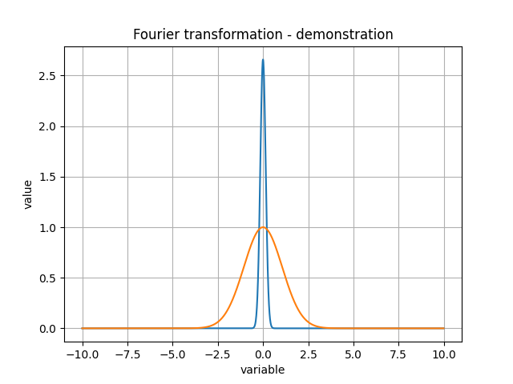

(Ez egy README fájl md, azaz markdown "nyelven" írva. Minden projekt README így kell, hogy kinézzen. A szintaxisról [itt](https://www.markdownguide.org/basic-syntax/) lehet találni lényegében mindent

# Fourier_transform

Ez egy teszt repository, ami az Alkalmazásfejlesztés projektlabor c. tárgyhoz készült.

Az itt található fájlok egy numerikus integráló programot valósítanak meg Python 3 nyelven, melyből öröklődéssel integráltranszformációkat implementáltam. Azért Fourier_transform a repository neve, mert ez volt az első integráltranszformáció, amit megvalósítottam.

A fájlok a következő funckiókat töltik be:

* *README.md* : ez a fájl
* *function_definition.py* : tartalmazza az összes függvény és osztály definiciót
* *numerical_integral.py* : egy tesztprogram, ami használja a *function_definition.py* fájlban lévő függvényeket és csinál egy ábrát is
* *test.png* : ez a tesztprogram kimeneti ábrája, íme

